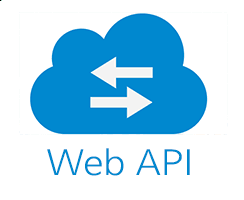

# Web API on CRM **Show & Tell**

---
@title[What Will be Covered?]

@snap[north-west span-50 text-center]
#### What Will be Covered?
@snapend

@snap[west span-55]
@ul[list-spaced-bullets text-06]
- What's Api?
- Why Web Api?
- Words about MicroService
- Archetectual Design of Web Api on CRM
- Dive into Codes
- Unit Testing
- Test Tools
- What's Next?
@ulend
@snapend

@snap[east span-45]

@snapend

---
@snap[north-west span-50 text-center]
#### What's API?
@snapend

@snap[west span-55]
@ul[list-spaced-bullets text-06]
- As per Wikipedia's Definition of API: In computer programming, an application programming interface (API) is a set of subroutine definitions, protocols, and tools for building software and applications.
- Web Api: a Web API is an API (application programming interface) for either a web server or a web browser.
@ulend
@snapend

@snap[north-east span-45]

@snapend

@snap[south-east span-45]

@snapend

---

#### Why Web API?

---

@snap[east span-20]
#### A typical Web Api Controller code structure
@snapend

@snap[west span-80]

@snapend

---?code=src/csharp/altchoicecontroller.cs&lang=csharp

@snap[north-east span-100 text-pink text-06]
Let look into code fragments!
@snapend

@snap[south span-100 text-gray text-08]
@[1-4](Authorize - providing authorization; ApiController - get default behaviours; Route - avoid using [controller] with strong coupling to class name)
@[6-11, zoom-08](Injecting ICrmAltChoiceCreateService as dependency)
@[13-14, zoom-08](HttpPost - creat; Return IActionResult with Http Status Code)
@[22-29, zoom-08](Calling service to create alternative offer)
@[31-38, zoom-08](Retuns response to caller depending on status)
@snapend

---?image=assets/img/code.jpg&opacity=60&position=left&size=45% 100%

@snap[east span-50 text-center]
## Now Let's **Run** the Codes
@snapend

